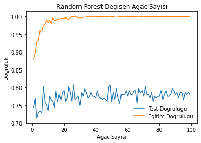

# DiyabetTahmin
Makine Öğrenmesi ile diyabet tahmini (K-NN, Logistic Regression, Naive Bayes, Random Forest Classifier, Decision Tree Classifier)  
**Not: Kodların sonuçlarını anlık olarak görmek için aynı kodlar jupyther-notebook ile de yazılmıştır.**  
>1. Sınıflandırma algoritmalarında gerekli verileri kullanabilmek için önce "veriler" sınıfını yazdık. 
>2. Sonra sınıflandırma algoritmalarında sonuçları şekil üzerinde gösterebilmek için "gorsel" sınıfını yazdık. 
>3. En son ise hazırladığımız bu sınıfları import ederek sınıflandırma algoritmalarını yazdık.
## K Nearest Neighbor Algoritması Sonuçları
 
## Random Forest Classification Algoritması
 
## Logistic Regression Algoritması
 
## Gaussian Naive Bayes Algoritması
 
## Decision Tree Classification Algoritması
 
